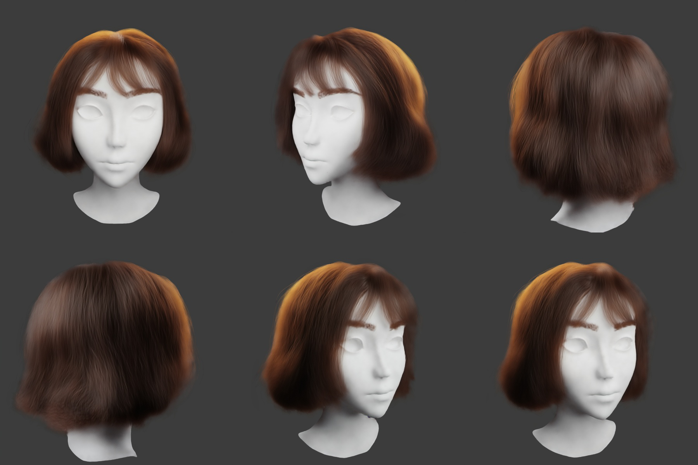

# NPCR

Neural Point Cloud Rendering via Depth Peeling Multi-Projection and Temporal Refine

## Abstract
In order to improve temporal stability and reduce overfitting, I improved NOPC by adding depth peeling projection and temporal refine reprojection

## Get Started
### Dependencies:
- python 3.6
- [pytorch>=1.2](https://pytorch.org/)
- torchvision
- opencv
- [ignite=0.2.0](https://github.com/pytorch/ignite)
- [yacs](https://github.com/rbgirshick/yacs)
- [Antialiased CNNs](https://github.com/adobe/antialiased-cnns) (already contained)
- [apex](https://github.com/NVIDIA/apex)
- [PCPR](https://github.com/wuminye/PCPR) (**NOTICE**: I have submitted an issue on a bug. You should fix it and run `python setup.py install`)

### Datasets&Models
You can download [here](https://pan.baidu.com/s/13OSRdVeFRDoPoTUW9bgCKA), extraction code: xc3k. \
Unzip `datasets.zip` to `datasets/` and `nr_models.zip` to `models/`\
or Unzip `Hair2_layer_6.zip` , put `nr_model_205.pth` in `models/` and the other in `datasets/Hair2` (recommend)\
Hair2 datasets：
- Images was generated by ray tracing
- Alpha matte was generated by rasterization directly
- Pointclouds was generated by sampling from quads and curves

Use Tesla V100 for training, the video memory occupies 13/16G, and the average rendering speed of a single image is 250ms 

## Rendering
Take 'Hair' model as example
- copy and rename `configs/config_Hair.yml` to `models/config.yml`
- copy and rename `ExParamGen/CamPose_Hair.inf` to `models/CamPose.inf`
- copy `datasets/Hair/Intrinsic.inf` to `models/Intrinsic.inf`
- rename `models/nr_model_Hair.pth` to `models/nr_model_0.pth`
- modify `models/config.yml`, LOAD_EPOCH = 0
- run `tools/render.py`

The project has been configured with Hair2 model by default 

## Train
Take 'Hair' model as example
- copy and rename `configs/config_Hair.yml` to `configs/config.yml`
- run `tools/train.py`

The checkpoint will be saved in `output/` \
If you set `configs:RESUME` True, you should ensure checkpoint files(including nr_model_xx.pth and nr_optimizer_xx.pth) in `output/`\
I recommend setting one layer at the beginning of training, increase layers after a period of training 

## Refine
- Configure files as 'Rendering'  
- run `tools/refine.py`

Refine Net will consume a long time and take up a lot of video memory. I recommend targeted refining and using `render.py` preprocessing images to save video memory

## Camera Extrinsics Generator
- copy one extrinsic matric to `ExParamGen/CamPose.inf` 
- run `ExParamGen/exgen.py`

The script will generator camera surrounding extrinsics

## Some Results Display
The picture on the left is generated by my program, and the one on the right is the original paper\
Because GIF is compressed, the display effect may be poor. It is recommended to view the video directly(`./results/*.mp4`)

